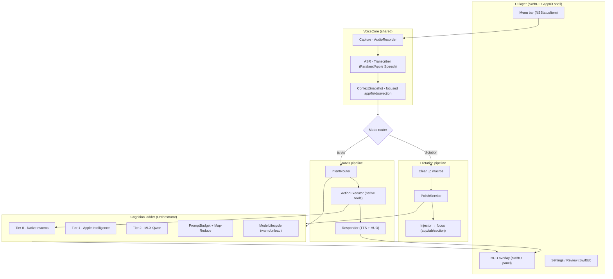
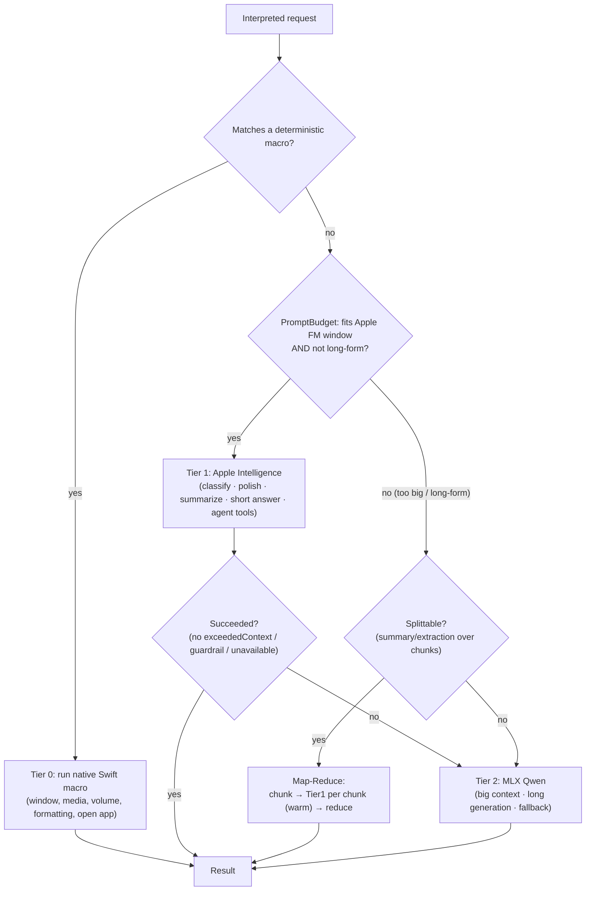
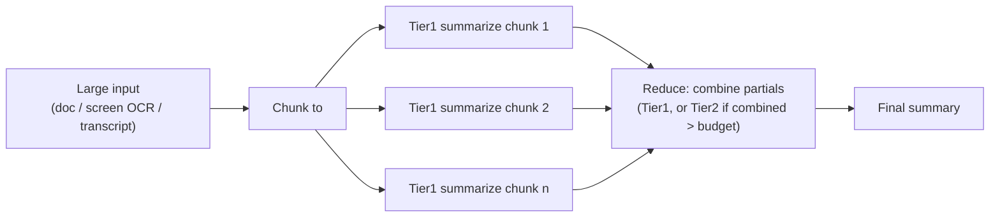
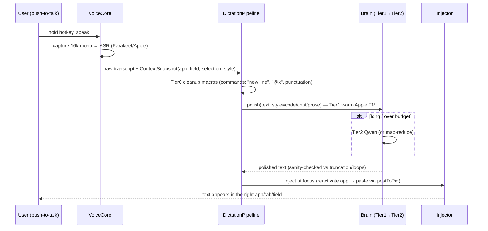
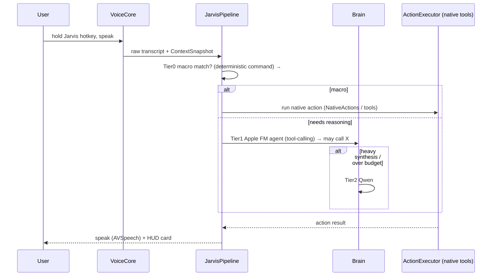
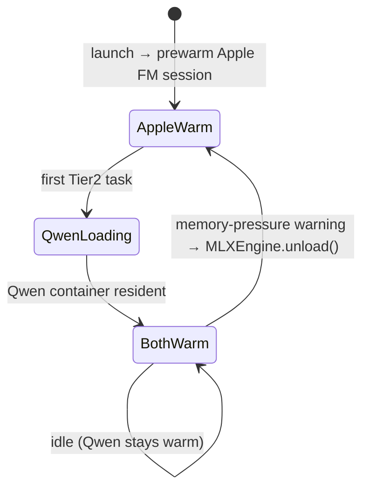
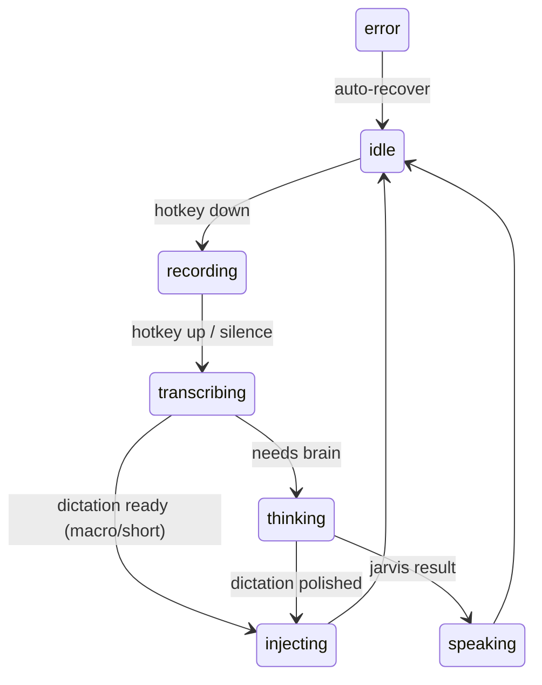

# Sotto — Architecture

Fully on-device, native-Swift voice platform for Apple Silicon. Two products on one core:
a **Dictation** tool (Wispr-Flow-class: listen → polish → paste at focus) and **Jarvis**
(whole-OS voice assistant). No Python, no servers, no network at inference time.

---

## 1. Requirements

### Functional
- **FR1 — Shared VoiceCore.** One capture + ASR + context-snapshot path used by both products.
- **FR2 — Two pipelines.** Dictation and Jarvis share listen/interpret tech but have distinct command grammars, routing, and outputs.
- **FR3 — Dictation.** Transcribe → AI-polish (context-aware: code/chat/prose) → inject at the *exact* focus (app → window/tab → field/section). Refined, low-latency, Wispr-Flow quality.
- **FR4 — Jarvis.** Transcribe → intent → plan → execute native OS actions/tools → speak + show result.
- **FR5 — Brain routing.** Apple Intelligence is **first** (OS-baked, fast: read/classify/summarize/polish/agent). Qwen (MLX) is **fallback + big content** (long generation, large context, Apple FM unavailable/exhausted).
- **FR6 — Cognition ladder.** Prefer the cheapest competent tier: deterministic native macros → Apple FM → Qwen. Decompose work into small native "macros" wherever possible.
- **FR7 — Prompt-budget flow.** Detect/avoid token-window exhaustion; degrade gracefully (route to Qwen, or chunk + map-reduce) instead of failing.
- **FR8 — Native UI.** Menu bar, HUD, settings, response cards — SwiftUI/AppKit only.

### Non-functional
- **NFR1 — Latency.** Native macros < 50 ms; dictation polish < ~1 s (warm Apple FM); no per-call cold start.
- **NFR2 — Memory (8 GB M1).** Both models cannot be hot under load. Apple FM is system-shared; Qwen is lazy-loaded, warm-after-first-use, and **unloaded under memory pressure**.
- **NFR3 — Privacy.** 100% on-device, offline-capable.
- **NFR4 — No dead-ends.** Every LLM step has a deterministic or alternate fallback.
- **NFR5 — Extensibility.** Add macros/tools/commands without touching the core.
- **NFR6 — Native only.** Swift + Apple frameworks + MLX-Swift. No Python/shell for shipped features.

### Constraints
- Apple Foundation Models: ~4k-token context, guardrails, macOS 26+.
- MLX Qwen: ~1 GB RAM (4-bit), GPU; first-use model download.
- Synthetic keystroke injection ⇒ Developer-ID distribution (not App Store).

---

## 2. Layered overview

---

## 3. The Cognition Ladder (how "everything routes")

The Orchestrator always tries the cheapest tier that can do the job, escalating only when needed.
This is the "divide even small tasks into macros, think like the Neural Engine" model.

**Tier 0 — Native macros (no LLM):** `CommandEngine.checkZeroLatencyShortcut` + `NativeActions`
(window AX, media keys, browser keystrokes, volume/brightness, dark mode, sleep/lock/trash) and the
deterministic dictation formatting rules. Instant, zero tokens.

**Tier 1 — Apple Intelligence (default):** classification, dictation polish (warm reused session),
summarize/read, short Q&A, and the Jarvis tool-calling agent. Fast and OS-baked.

**Tier 2 — MLX Qwen (fallback + big):** long-form generation (posts, reports), large-context tasks,
and anything Tier 1 declines (context overflow, guardrail, unavailable). Warm, in-process, GPU.

---

## 4. Prompt-budget & token-exhaustion flow

Two defenses so Apple FM's ~4k window never dead-ends a task:

1. **Pre-flight budget (proactive).** `PromptBudget.estimate(text)` (~chars/4) vs a safe ceiling
   (~3000 of 4096, leaving room for output). Over budget → route to **Qwen** (large context) or
   **map-reduce** if the task is decomposable (summaries, extraction, screen-OCR digestion).
2. **Runtime fallback (reactive).** Catch `LanguageModelSession.GenerationError.exceededContextWindowSize`
   / `.guardrailViolation` / unavailability → transparently retry on **Qwen**.

**Map-reduce for big read/summarize** (the "break a big task into small macro tasks" idea):

---

## 5. Dictation pipeline (product A — Wispr-Flow-class)

Refinements to reach "better than Wispr Flow": per-app style profiles, learned vocabulary/style
(already persisted), selection-aware rewrite, and `ContextSnapshot` capturing the focused AX element
(field/section) so the paste target is exact.

## 6. Jarvis pipeline (product B — OS assistant)

---

## 7. Memory lifecycle (8 GB)

`ModelLifecycle` subscribes to `DISPATCH_SOURCE_TYPE_MEMORYPRESSURE`; on `.warning`/`.critical`
it calls `MLXEngine.unload()`. Apple FM stays warm (system-shared, cheap).

---

## 8. Key decisions (ADRs)

### ADR-001 — Three-tier cognition ladder (macros → Apple FM → Qwen)
**Status:** Accepted.
**Context:** Need lowest latency + token thrift on 8 GB, with no dead-ends.
**Decision:** Route every request through Tier 0 (deterministic native), then Tier 1 (Apple FM), then Tier 2 (Qwen), escalating only on miss/failure.
**Alternatives:** (a) Single LLM for everything — simpler but slow/expensive and hits the 4k wall. (b) Always Qwen — heavy RAM, slower cold start.
**Trade-offs:** More routing logic, but big latency/memory/robustness wins. Prioritizes responsiveness over architectural simplicity.

### ADR-002 — Apple Intelligence primary; Qwen fallback + big-content
**Status:** Accepted.
**Decision:** Apple FM handles classify/polish/summarize/short-answer/agent. Qwen handles long-form, large-context, and any Apple FM failure.
**Alternatives:** Qwen-primary (rejected: RAM + cold start), Apple-only (rejected: 4k window + guardrails block big tasks).
**Trade-offs:** Two engines to maintain; mitigated by a single `QwenRefiner` routing facade.

### ADR-003 — Shared VoiceCore, two independent pipelines
**Status:** Accepted.
**Decision:** Capture+ASR+ContextSnapshot is shared; Dictation and Jarvis are separate pipeline types selected by mode, each with its own grammar/router/output.
**Alternatives:** One mega-handler (today's `endRecording` switch) — rejected: tangled, hard to tune each product.
**Trade-offs:** Requires extracting an Orchestrator from `AppController`; pays off in testability and per-product tuning.

### ADR-004 — Map-reduce for context-exhausting tasks
**Status:** Accepted.
**Decision:** Decompose big read/summarize tasks into chunked Tier-1 calls + a reduce step; reserve Qwen for non-decomposable large generation.
**Trade-offs:** Keeps fast Apple FM in play for big inputs at the cost of multiple calls (parallelizable on the warm session).

### ADR-005 — Lazy Qwen + memory-pressure unload
**Status:** Accepted.
**Decision:** Load Qwen on first Tier-2 use, keep warm, unload on memory pressure.
**Trade-offs:** First heavy task pays load cost; protects 8 GB stability.

### ADR-006 — Native SwiftUI UI over an AppKit shell
**Status:** Proposed.
**Decision:** Build HUD, Settings, and response cards in SwiftUI; keep AppKit for the `NSStatusItem`, global event taps, and the non-activating floating panel (these need AppKit/CGEvent).
**Alternatives:** All-AppKit (today) — works but harder to make refined/animated; all-SwiftUI (can't host the status item / event tap cleanly).
**Trade-offs:** SwiftUI-in-NSPanel bridging, for a much more polished, Wispr-Flow-like feel.

---

## 9. Native SwiftUI UI design

Design language: **floating glass HUD**, minimal, SF Symbols, system materials, full dark-mode,
reduced-motion aware, VoiceOver labels.

- **Menu bar (`NSStatusItem`)** — mic glyph reflects state (idle/listening/thinking/speaking); menu: mode, engine, model, permissions, settings.
- **HUD overlay (`NSPanel`, non-activating, `.floating`, hosting a SwiftUI view)** — live waveform while listening, tier indicator ("⚡︎ native" / "Apple Intelligence" / "Qwen"), streaming result, success/▲error toast. Bottom-center, like Wispr Flow.
- **Settings (SwiftUI `Form`)** — capture engine, MLX model + RAM hint, voice + rate/pitch, push-to-talk vs toggle, per-app dictation style profiles, live permission status chips.
- **Jarvis response card** — markdown result with copy/inject actions; **Prompt review** sheet before sending to Claude.

State drives UI via an `@Observable AppState` (idle/recording/transcribing/thinking(tier)/injecting/speaking/error).

---

## 10. Mapping to the current code

| Architecture component | Today | Action |
| --- | --- | --- |
| VoiceCore | `AudioRecorder`, `Transcriber`, `ContextDetector` | Wrap as one `VoiceCore` type; enrich `ContextSnapshot` (focused AX field/section) |
| Mode router + Orchestrator | the big switch in `AppController.endRecording` | **Extract** into `Orchestrator` + `DictationPipeline` / `JarvisPipeline` |
| Tier 0 macros | `CommandEngine.checkZeroLatencyShortcut`, `NativeActions` | Keep; formalize as a `Macro` registry |
| Tier 1 / Tier 2 brain | `QwenRefiner` (Apple warm) + `MLXEngine` (Qwen) | Keep; add `PromptBudget` + map-reduce + runtime fallback routing |
| Jarvis agent + tools | `JarvisAgent`, `JarvisToolbox` | Keep under `JarvisPipeline` |
| Injection | `TextInjector` (`postToPid`) | Keep; add AX-element-targeted insertion for exact field/section |
| Memory | (none) | Add `ModelLifecycle` (pressure → `MLXEngine.unload()`) |
| UI | AppKit `StatusBarController`, `HUDOverlay`, `SettingsWindow` | Migrate HUD/Settings to SwiftUI (ADR-006) |

---

## 11. Risks & mitigations

| Risk | Mitigation |
| --- | --- |
| 8 GB pressure with Qwen + Apple FM | Lazy load + memory-pressure unload (ADR-005); small 4-bit default model |
| Apple FM 4k window / guardrails block tasks | PromptBudget + map-reduce + Qwen fallback (ADR-004) |
| Injection focus race | `postToPid` (done) + AX-targeted insertion |
| Map-reduce latency on big inputs | Parallelize chunk calls on the warm session; cap chunk count |
| Two-engine complexity | Single `QwenRefiner` facade; tier selection centralized in `Orchestrator` |
| SwiftUI/AppKit bridging | Keep event tap + status item in AppKit; SwiftUI only for views |

---

## 12. Phased implementation

- **P1 — Orchestrator extraction.** Pull `Orchestrator` + `DictationPipeline` / `JarvisPipeline` out of `AppController`; formalize the Tier-0 macro registry. (Refactor; behavior-preserving.)
- **P2 — Brain routing.** Add `PromptBudget`, runtime context-overflow fallback, and map-reduce summarize. Wire tier indicator.
- **P3 — Memory lifecycle.** `ModelLifecycle` + pressure unload.
- **P4 — Dictation refinement.** Per-app style profiles, AX-targeted injection, selection rewrite.
- **P5 — Native SwiftUI UI.** HUD + Settings + response card on `@Observable AppState`.
